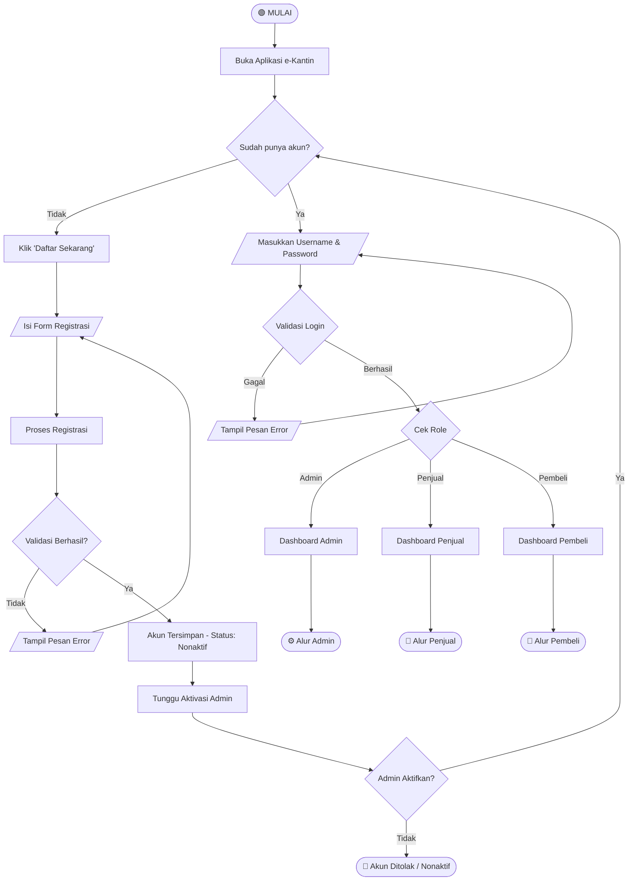
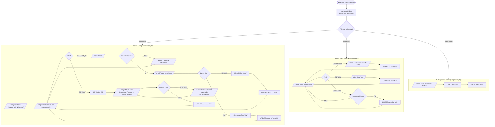
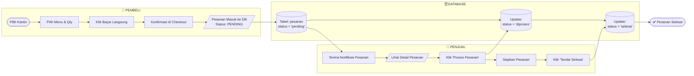
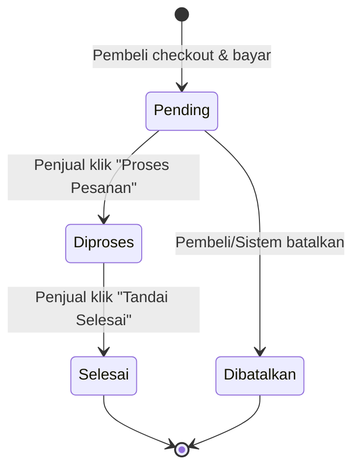

# 📊 Flowchart Lengkap Sistem e-Kantin

> Dokumentasi alur sistem aplikasi **e-Kantin** — platform pemesanan makanan kantin berbasis web dengan 3 role: **Admin**, **Penjual**, dan **Pembeli**.

---

## 🔑 Legenda Simbol

| Simbol              | Nama         | Artinya                            |
| ------------------- | ------------ | ---------------------------------- |
| `(Oval)`            | Terminal     | Titik Mulai / Selesai              |
| `[Kotak]`           | Proses       | Aksi/langkah yang dilakukan        |
| `{Belah Ketupat}`   | Keputusan    | Percabangan Ya / Tidak             |
| `[/Jajar Genjang/]` | Input/Output | Data yang dimasukkan / ditampilkan |

---

## 1. 🌐 Flowchart Sistem Keseluruhan (Overview)



---

## 2. 🔐 Flowchart Login & Registrasi

```mermaid
flowchart TD
    START([🟢 START]) --> A[Buka index.php]
    A --> B{Sudah Login / Ada Session?}
    B -->|Ya| C{Cek Role Session}
    C -->|admin| D[Redirect → admin/dashboard.php]
    C -->|penjual| E[Redirect → penjual/dashboard.php]
    C -->|pembeli| F[Redirect → pembeli/dashboard.php]

    B -->|Tidak| G[/Tampil Form Login/]
    G --> H[/Input: Username + Password/]
    H --> I[Submit Form POST]
    I --> J{Username ada di DB?}

    J -->|Tidak| K[/Error: 'Username tidak ditemukan'/]
    K --> G

    J -->|Ya| L{Password cocok? \npassword_verify\(\)}
    L -->|Tidak| M[/Error: 'Password Salah'/]
    M --> G

    L -->|Ya| N{Status Akun = 'aktif'?}
    N -->|Tidak| O[/Error: 'Akun Tidak Aktif. Hubungi Admin.'/]
    O --> G

    N -->|Ya| P{Role = ?}
    P -->|admin| Q[Set Session admin\nRedirect → admin/dashboard.php]
    P -->|penjual| R[Ambil data Toko dari DB\nSet Session penjual + id_toko\nRedirect → penjual/dashboard.php]
    P -->|pembeli| S[Set Session pembeli\nRedirect → pembeli/dashboard.php]

    Q --> END1([✅ Masuk Halaman Admin])
    R --> END2([✅ Masuk Halaman Penjual])
    S --> END3([✅ Masuk Halaman Pembeli])

    subgraph REGISTER ["📝 Alur Registrasi (apps/register.php)"]
        R1[Klik 'Daftar Sekarang'] --> R2[/Input: Username, Password,\nNo.Telepon, Email/]
        R2 --> R3{Validasi Username:\n3-20 karakter,\ntanpa spasi,\nhuruf/angka saja}
        R3 -->|Tidak Valid| R4[/Alert Error Validasi/]
        R4 --> R2
        R3 -->|Valid| R5{Username sudah\nterdaftar di DB?}
        R5 -->|Ya| R6[/Error: 'Username sudah digunakan'/]
        R6 --> R2
        R5 -->|Tidak| R7{Email sudah\nterdaftar di DB?}
        R7 -->|Ya| R8[/Error: 'Email sudah terdaftar'/]
        R8 --> R2
        R7 -->|Tidak| R9[Hash Password\nINSERT ke tabel users\nRole: pembeli, Status: nonaktif]
        R9 --> R10[/Tampil Popup Sukses/]
        R10 --> R11([🔴 Tunggu Aktivasi Admin])
    end
```

---

## 3. 🛒 Flowchart Alur Pembeli (Lengkap)

```mermaid
flowchart TD
    START([🟢 Masuk sebagai Pembeli]) --> DASH[Dashboard Pembeli\npembeli/dashboard.php]

    DASH --> NAV{Pilih Menu Navigasi}

    NAV -->|Pesan Menu| ORDER
    NAV -->|Keranjang| CART_PAGE
    NAV -->|History| HISTORY
    NAV -->|Profil| PROFILE

    subgraph ORDER ["🍽️ Pesan Menu (pembeli/pesan.php)"]
        O1[Buka Halaman Pesan] --> O2{Ada id_toko di URL?}
        O2 -->|Tidak| O3[/Tampil Daftar Semua Kantin\nfrom tabel: toko/]
        O3 --> O4[Pilih Kantin]
        O4 --> O5[Redirect: pesan.php?id_toko=X]
        O5 --> O2

        O2 -->|Ya| O6[Ambil detail toko dari DB]
        O6 --> O7{Toko ditemukan?}
        O7 -->|Tidak| O8[Redirect → pesan.php]
        O8 --> O3
        O7 -->|Ya| O9[/Tampil Daftar Menu Produk\nfrom tabel: produk_kantin/]
        O9 --> O10[Klik Tombol + pada Menu]
        O10 --> O11{Qty ≥ Stok?}
        O11 -->|Ya| O12[/Toast: 'Stok tidak cukup ⚠️'/]
        O12 --> O9
        O11 -->|Tidak| O13[Tambah ke Cart JavaScript\naddToCart\(\)]
        O13 --> O14[/Update UI Keranjang\nTampil Sticky Bar/]
        O14 --> O15{Mau Checkout?}
        O15 -->|Tidak| O9
        O15 -->|Ya| O16[Submit Form ke checkout.php\nkirim: cart_data + id_toko]
    end

    subgraph CHECKOUT ["💳 Checkout (pembeli/checkout.php)"]
        C1[Terima Data POST:\ncart_data + id_toko] --> C2{Cart kosong\natau id_toko = 0?}
        C2 -->|Ya| C3[Redirect → pesan.php]
        C2 -->|Tidak| C4[Ambil nama_toko dari DB]
        C4 --> C5[/Tampil Rincian Pesanan\ndan Total Harga/]
        C5 --> C6[Klik 'Konfirmasi & Bayar']
        C6 --> C7[Submit ke proses_bayar.php\nkirim: id_toko, cart_data, total_harga]
        C7 --> C8[/Pesanan Tersimpan di DB\ntabel: pesanan + detail_pesanan/]
        C8 --> C9[Status Pesanan = 'pending']
        C9 --> END_C([✅ Pesanan Berhasil Dibuat])
    end

    subgraph CART_PAGE ["🛍️ Keranjang (pembeli/keranjang.php)"]
        K1[/Tampil Item di Keranjang/] --> K2[Ubah Qty atau Hapus Item]
        K2 --> K3[Klik 'Lanjut Checkout']
        K3 --> CHECKOUT
    end

    subgraph HISTORY ["📋 History Pesanan (pembeli/history.php)"]
        H1[Ambil data pesanan\nberdasarkan id_users dari DB] --> H2[/Tampil Riwayat Pesanan\nbeserta Status/]
    end

    subgraph PROFILE ["👤 Profil (pembeli/profil.php)"]
        P1[/Tampil Data Profil Pembeli/] --> P2[Edit Profil / Ganti Password]
        P2 --> P3[Update data di DB]
    end

    O16 --> CHECKOUT
```

---

## 4. 🏪 Flowchart Alur Penjual (Lengkap)

```mermaid
flowchart TD
    START([🟢 Masuk sebagai Penjual]) --> DASH[Dashboard Penjual\npenjual/dashboard.php]

    DASH --> NAV{Pilih Menu Navigasi}
    NAV -->|Kelola Pesanan| PESANAN
    NAV -->|Kelola Produk| PRODUK
    NAV -->|History| HISTORY_P
    NAV -->|Profil| PROFIL_P

    subgraph PESANAN ["📦 Kelola Pesanan (penjual/pesanan.php)"]
        PS1[Ambil semua pesanan\nberdasarkan id_toko dari DB] --> PS2[/Tampil Daftar Pesanan\ndengan badge status/]
        PS2 --> PS3{Filter Status?}
        PS3 -->|Semua| PS4[Tampil Semua]
        PS3 -->|Pending| PS5[Tampil Pending]
        PS3 -->|Diproses| PS6[Tampil Diproses]
        PS3 -->|Selesai| PS7[Tampil Selesai]

        PS4 & PS5 & PS6 & PS7 --> PS8[Klik Kartu Pesanan]
        PS8 --> PS9[/Tampil Popup Detail Pesanan:\nNama, Waktu, Menu, Catatan, Total/]

        PS9 --> PS10{Status Pesanan?}
        PS10 -->|pending| PS11[Klik 'Proses Pesanan']
        PS11 --> PS12[UPDATE status → 'diproses']
        PS12 --> PS13[Redirect → pesanan.php]

        PS10 -->|diproses| PS14[Klik 'Tandai Selesai']
        PS14 --> PS15[UPDATE status → 'selesai']
        PS15 --> PS13

        PS10 -->|selesai| PS16[/Tampil: 'Pesanan Selesai' ✅/]
    end

    subgraph PRODUK ["🍱 Kelola Produk (penjual/produk.php)"]
        PR1[/Tampil Daftar Produk Toko/] --> PR2{Aksi?}
        PR2 -->|Tambah| PR3[/Input: Nama Menu, Harga, Stok, Foto/]
        PR3 --> PR4[INSERT ke produk_kantin]
        PR4 --> PR1
        PR2 -->|Edit| PR5[/Ubah Data Produk/]
        PR5 --> PR6[UPDATE di produk_kantin]
        PR6 --> PR1
        PR2 -->|Hapus| PR7[DELETE dari produk_kantin]
        PR7 --> PR1
    end

    subgraph HISTORY_P ["📋 History (penjual/history.php)"]
        HP1[Ambil data pesanan selesai\nbased on id_toko] --> HP2[/Tampil Riwayat Penjualan/]
    end

    subgraph PROFIL_P ["👤 Profil (penjual/profil.php)"]
        PP1[/Tampil Data Profil & Toko/] --> PP2[Edit Profil / Info Toko]
        PP2 --> PP3[UPDATE data di DB]
    end
```



---

## 5. ⚙️ Flowchart Alur Admin (Lengkap)



---

## 6. 🔄 Flowchart Alur Pesanan End-to-End

Ini adalah alur **paling penting** — menggambarkan perjalanan satu pesanan dari Pembeli sampai Penjual:



---

## 📋 Ringkasan Status Pesanan



---

## 🗂️ Struktur File & Halaman

```
e-Kantin/
├── index.php               → Halaman Login
├── apps/
│   ├── register.php        → Daftar Akun (Pembeli)
│   └── lupaSandi.php       → Lupa Password
├── admin/
│   ├── dashboard.php       → Dashboard Admin
│   ├── kelola.php          → Kelola User (Aktif/Nonaktif/Edit)
│   ├── kelolaToko.PHP      → Kelola Data Toko
│   └── pengaturan.php      → Pengaturan Sistem
├── penjual/
│   ├── dashboard.php       → Dashboard Penjual
│   ├── produk.php          → Tambah/Edit/Hapus Menu
│   ├── pesanan.php         → Kelola Pesanan (Pending → Diproses → Selesai)
│   ├── history.php         → Riwayat Penjualan
│   └── profil.php          → Profil & Info Toko
└── pembeli/
    ├── dashboard.php       → Dashboard Pembeli
    ├── pesan.php           → Pilih Kantin & Menu
    ├── checkout.php        → Konfirmasi & Bayar
    ├── keranjang.php       → Keranjang Belanja
    ├── history.php         → Riwayat Pesanan
    └── profil.php          → Profil Pembeli
```
